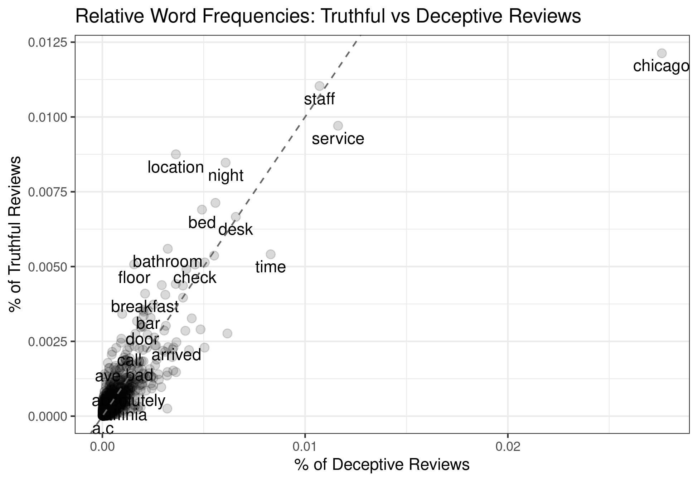

## Learning Goals

By the end of this tutorial you will be able to:

1.  Transform text data to obey "tidy" data principles.
2.  Summarize the length of a set of texts.
3.  Clean up text data by removing stop words, excess numbers, and lemmatize words.
4.  Visualize differences in text across different pre-classified classes of text.
5.  Classify the sentiment of a text as positive, negative or neutral.
6.  Evaluate the performance of a sentiment classification using confusion matrices and accuracy metrics.
7.  Discuss whether a pre-existing sentiment lexicon should be used in a particular application.
8.  Discuss the managerial relevance of your findings from text analysis. 

## Instructions to Students

These tutorials are **not graded**, but we encourage you to invest time and effort into working through them from start to finish.
Add your solutions to the `lab_answer.Rmd` file as you work through the exercises so that you have a record of the work you have done.

The goal of the tutorials is to explore how to "do" the technical side of social media analytics.
Use this as an opportunity to push your limits and develop new skills.

## Exercise 1: Text Analytics with Fake Reviews

This exercise works with data on hotel reviews.
The reviews are a collection of truthful and deceptive (i.e. fake) reviews of 20 hotels in the Chicago area, known in the computational linguistics community as the Deceptive Opinion Spam dataset.[^1]
Deceptive reviews are reviews that have been written by someone who has not stayed at the hotel they are reviewing.
The data contains 1600 reviews:

[^1]:  The data originally was published in the paper "Finding Deceptive Opinion Spam by Any Stretch of the Imagination" by M.
    Ott, Y. Choi, C. Cardie, and J.T.
    Hancock in 2011 in the Proceedings of the 49th Annual Meeting of the Association for Computational Linguistics: Human Language Technologies

-   400 truthful, positive reviews from TripAdvisor
-   400 deceptive positive reviews from Mechanical Turk
-   400 truthful, negative reviews from Expedia, Hotels.com, Orbitz, Priceline, TripAdvisor, and Yelp
-   400 deceptive negative reviews from Mechanical Turk

The data is saved as part of this repository, stored in `data/reviews.csv`:

You might need to use the following `R` libraries throughout this exercise:[^2]

[^2]:  If you haven't installed one or more of these packages, do so by entering `install.packages("PKG_NAME")` into the R console and pressing ENTER.

```{r, eval = TRUE, message=FALSE, warning=FALSE}
library(readr)
library(dplyr)
library(tibble)
library(tidyr)
library(stringr)
library(tidytext)
library(ggplot2)
library(magrittr)
library(textstem)
library(reshape2)
library(wordcloud)
library(vader)
library(yardstick)
library(stm)
```

1.  Assuming online reviews are all truthful, explain whether they should benefit or harm consumers and the hotels themselves.

Write your answer here

2.  If fake reviews are mixed in with truthful reviews on a website (for example, TripAdvisor) identify two reasons why their presence may harm consumers, hotels and the review website. Explain the mechanisms through which the harm is done.

Write your answer here

3.  Load the data located in `data/reviews.csv` into a data frame called `hotel_reviews`.

```{r}
# Write your answer here
```

4.  In what follows we will need each hotel review (i.e. each row of the data) to have a unique identifier. Create a new column called `ID` in the dataset that has a unique identifier for each review.

HINT: the function `row_to_column()` function will help you do this.

```{r}
# Write your answer here
```

5.  Convert the dataset to conform with tidy data principles:

-   Each variable is a column
-   Each observation is a row
-   Every cell is a single value

Name the resulting dataset `tidy_reviews`.

```{r}
# Write your answer here
```

6.  Create a dataset called `review_length` that has two columns, a column that identifies the review and a column that counts the number of words in the review. Merge the the `review_length` data into the `hotels_df` dataset.

```{r}
# Write your answer here
```

7.  Are deceptive reviews longer than truthful reviews? If you presented this result to a marketing manager that has little analytics training what do you expect they would say about the possibility of detecting deceptive reviews? Would you agree or disagree?

```{r}
# Write your answer here
```

8.  What are stop words? Explain why you would want to remove them from the review text.

Write your answer here

9.  Remove stop words from each review using a default stop word list. Name the dataset with no stop words `tidy_reviews_no_stop`. What are the 20 most common words in the dataset?

```{r}
# Write your answer here
```

10. Create a custom stop word list that contains words you might want to remove in addition to the default stop word list. Remove these words from `tidy_reviews_no_stop`.

```{r}
# Write your answer here
```

11. Also remove any numbers from `tidy_reviews_no_stop`.

The following code can be used to get started:

```{r, eval = FALSE}
# First, find all numbers:
nums <- YOUR_CODE %>%
  # find all numbers in the data
  filter(str_detect(word, "^[0-9]")) %>%
  YOUR_CODE

# now remove those:
tidy_reviews_no_stop <- YOUR_CODE
```

```{r}
# Write your answer here
```

The next step we want to perform is to lemmatize each word.
The goal of lemmatizing is to reduce inflectional forms and some common derivationally related forms of a word to a base word.
For example:

-   am, are, is $\Rightarrow$ be
-   car, cars, car's, cars' $\Rightarrow$ car

To lemmatize each word in the reviews we will use the `lemmatize_words()` from the `textstem package`:[^3]

[^3]:  An alternative would be to "stem" each word, which essentially chops off the ends of words in the hope of achieving this goal correctly most of the time, and often includes the removal of derivational affixes.

```{r}
# Write your answer here
```

12. Create a plot that graphs the frequency a word is used in deceptive reviews on the x-axis against the frequency the same word is used on the y-axis. To help you in coding up this plot, your final result should look like the following:[^4]

[^4]:  Depending on your custom stopword list in (10) you might see slight differences between your figure and this one.

```{r, echo = FALSE, eval = TRUE, fig.align="center", out.width="75%"}

```

Perform the following steps:

(a) Create a dataset called `wrd_frequency` that has three columns: a column `word` that contains all the unique words, a column `deceptive` that has the percentage of deceptive reviews that each word is included in and a column `truthful` that has the percentage of truthful reviews that each word is included in.
(b) Create the plot described above. Include a 45 degree line for reference.

To assist you in creating the plot, use the following starter code:

```{r, eval = FALSE}
# part (a)
wrd_frequency <- tidy_reviews_lemma %>%
  count(YOUR_CODE) %>%
  group_by(YOUR_CODE) %>%
  mutate(YOUR_CODE) %>% 
  spread(YOUR_CODE)

# part (b)
wrd_frequency %>%
  ggplot(aes(x = YOUR_CODE, 
             y = YOUR_CODE, 
             label = YOUR_CODE 
           )) +
  geom_YOURCODE(alpha = 0.15, 
                size = 2.5
              ) +
  geom_text(aes(label = YOUR_CODE), 
            check_overlap = TRUE, 
            vjust = 1.5
            ) +
  geom_abline(YOUR_CODE,
              lty = 2, 
              color = "grey40"
              ) +
  YOUR_CODE
```

```{r}
# Write your answer here
```

An alternative way to visualize the differences and commonalities in word use between truthful and deceptive reviews is to construct word clouds.
To assist you in creating the plots, use the following starter code for each of the next two questions:

```{r, eval=FALSE}
tidy_reviews_lemma %>%
  count(YOUR_CODE, 
        YOUR_CODE, 
        sort = TRUE
        ) %>%
  acast(YOUR_CODE ~ YOUR_CODE, 
        value.var = "n", 
        fill = 0
        ) %>%
  YOUR_CODE
```

13. Create a word cloud that visualizes the differences in word use between deceptive and truthful reviews. Use a maximum of 75 words in the word cloud.

```{r}
# Write your answer here
```

14. Create a word cloud that visualizes the commonalities in word use between deceptive and truthful reviews. Use a maximum of 75 words in the word cloud.

```{r}
# Write your answer here
```

15. Provide a brief summary of what you learn from the three plots. (Max. 10 sentences)

Write your answer here

16. (Harder!) Suppose you were working in an analytics team that wanted to build a predictive model to detect fake reviews on a platform such as TripAdvisor.

```{=html}
<!-- -->
```
(a) Can you sketch out a method/model to predict whether a review is fake? Your method should be scaleable so that it can handle thousands of new reviews per day. You can use any combination of words, figures, simple equations or pseudocode to explain your thoughts.

Write your answer here

(b) How could you assess how successful the model is at detecting fake reviews?

Write your answer here

(c) Suppose the model was adopted by the platform. If you detected a newly posted review was fake, would you want to remove it from the platform? Or would you leave the review online with a notification that this review might be fake? Explain.

Write your answer here

## Exercise 2: Sentiment Analysis

One of the main tasks marketers perform with text is sentiment analysis, i.e. classifying text as positive, negative to neutral in tone.
The VADER sentiment lexicon (Hutto and Gilbert, 2014) is one of the better performing methods for sentiment analysis if one does not want to engage in a complex statistical exercise to create a customized sentiment model.[^5]
This exercise is going to use the VADER lexicon to evaluate the sentiment of hotel reviews from the Deceptive Opinion Spam dataset.

[^5]:  Want to know more about VADER?
    Read the original paper [here](http://comp.social.gatech.edu/papers/icwsm14.vader.hutto.pdf).
    The paper isn't too long.
    [SentiBench](https://arxiv.org/abs/1512.01818) (Riberio et al, 2016) provides a comprehensive evaluations of sentiment lexicons in English.

1.  Why might the classification of text into positive, negative and neutral sentiment be useful for marketers and managers?

**Write your written answer here**

*(The `hotel_reviews` dataset with a unique ID column was already loaded in Exercise 1, Questions 3--4. Use that object directly below.)*

2.  Create a smaller dataset called `hotel_sentiment` that only includes the columns `id`, `polarity`, and `text`.

```{r}
# Write your answer here
```

As discussed above, our weapon of choice for sentiment analysis will be the VADER lexicon.
VADER doesn't want the data in a 'tidy' format because it uses the punctuation, capitalization and emojis when it evaluates the sentiment in a text.
Let's get started using VADER.

3.  To classify multiple review's sentiment in one go, the `vader` package has a function called `vader_df()`. The starter code below shows you how to use the function - you pass across the column of the dataset that has the text you want to analyse row by row. Adapt the code to run on the `hotel_sentiment` data set.

```{r, eval=FALSE}
# VADER is pretty nice in that we shouldn't need to clean it
vader_sent <-
  vader_df(DATANAME$TEXTCOLUMN)
```

NOTE: Note that when you run it, it might take a while to run from start to finish.

```{r}
# Write your answer here
```

The output here is useful.
First, some reviews generated errors, and we'll need to drop those for the rest of our analysis.
The main column of interest is `compound` which computes the sentiment of a text as a number ranging between -1 (most negative) and +1 (most positive).

The code below uses the compound score to classify a review as positive or negative.
To run it, change `eval=FALSE` to `eval = TRUE` in the Rmd file.

```{r, eval = FALSE}
vader_sent2 <- 
  vader_sent %>%
  # we need a row number to merge it back into 
  # our original data
  rowid_to_column("ID") %>%
  # remove any errors
  filter(word_scores != 'ERROR') %>%
  # classify as positive or negative
  mutate(vader_class = case_when(
        compound < 0 ~ "negative",
        # the final case must always be written as
        # TRUE ~ SOMETHING
        TRUE ~ "positive"
        )
    ) %>%
  select(ID, vader_class)
```

4.  Merge the sentiment classifications from VADER back into the `hotel_sentiment` data. Use the following code to get started:

```{r}
# Write your answer here
```

The hotel data already had a sentiment measure in it, `polarity`.
Let's compare the VADER sentiment classification to this measure to see how well it performed.

5.  We will measure VADER's performance using a confusion matrix and assessing model accuracy. Think of the `polarity` column as the true classification to compare predictions to.

```{=html}
<!-- -->
```
(a) Explain what a confusion matrix is.
(b) Evaluate VADER's predictions relative to `polarity` using a confusion matrix (`conf_mat()` in R).
(c) Explain what model accuracy is.
(d) Evaluate VADER's accuracy relative to `polarity` using a confusion matrix (`accuracy()` in R).
(e) Explain the results

```{r}
# Write your code here
```

**Write your written answer here**

6.  The authors of the VADER lexicon advocate for using three classes for prediction - positive, negative and **neutral**. Their suggestion is to classify text into these three classes as follows:

-   Positive Tweet: $compound \in (0.05, 1]$
-   Neutral Tweet: $compound \in [{-0.05}, 0.05]$
-   Negative Tweet: $compound \in [{-1}, -0.05)$

Update the provided code above to implement this three class classification.
(You should not need to re-run the `vader_df()` command to do this)

```{r}
# Write your answer here
```

7.  Plot the frequency of each class from (6) as a bar chart. Does the plot suggest that adding a neutral class provides an improvement in this example?

```{r}
# Write your answer here
```

8.  Based on the performance we see here, would you recommend using VADER to classify hotel reviews as positive or negative if you were a marketing analyst for a hotel chain? Why or why not? If not, what might you do instead?

**Write your answer here**

9.  (Optional) The reading for this week, Text Mining with R, uses different sentiment lexicons to classify texts. Try one or more of these out on this text, and evaluate their performance. Can you find a lexicon that does better than VADER?
